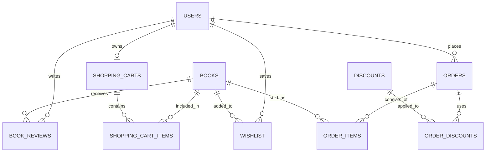

# Online Bookstore Engine

## Overview

This project is an online bookstore built with **Next.js 16 (App Router)**, **React 19**, **Tailwind CSS 4.0**, and **Supabase**. It implements a balanced **SSR (Server-Side Rendering)** and **CSR (Client-Side Rendering)** approach to maximize security, SEO, and interactive performance. The engine integrates authentication, real-time shopping cart management, wishlist tracking, dynamic search capabilities, and advanced filtering/sorting.

## Project Status

**Current Phase**: Core marketplace MVP - Production-ready with strong automated test coverage
**Test Coverage**: **95.40% average coverage** (93% statements, 99.23% branches, 96.17% functions)
**Performance**: Lighthouse Desktop 99/100 (0.3s FCP, 0.8s LCP, 0ms TBT, 0 CLS)
**Last Updated**: July 19, 2026 (latest automated coverage report)

## Key Highlights

- ✅ **Strong automated coverage**: Core storefront routes, components, data actions, and providers are well covered by Jest
- ✅ **9 Sort Options**: Including Best Sellers (implemented via sales_count), price, release date, ratings
- ✅ **Real-time Sync**: Shopping cart and wishlist sync across devices via Supabase listeners
- ✅ **Schema-First Validation**: All inputs validated with Zod from client to database
- ✅ **Advanced State Management**: Dual-Context + Reducer pattern preventing re-render loops
- ⚠️ **1 Known TODO**: User review submission (read-only currently) - marked in BookReviews.tsx:18

## Architecture & Engineering Decisions

### Dual Context + Reducer Pattern

The application uses a sophisticated state management architecture to prevent unnecessary re-renders:

```typescript
User/Cart Reducer (pure, centralized logic)
    ↓
UserStateContext / CartStateContext (data only)
UserActionsContext / CartActionsContext (dispatch functions)
    ↓
Components subscribe only to what they need
```

**Benefits:**
- Logout buttons don't re-render when cart data changes
- Atomic state updates prevent intermediate inconsistent states
- Server actions and real-time listeners both update through the same reducer
- No useState callback chains or prop drilling

### Seeded Initial State Pattern

RootLayout fetches user and cart data server-side, injecting pre-loaded providers:
- **Result**: Cumulative Layout Shift (CLS) = 0
- **Benefit**: Users see correct state immediately, no loading flicker
- **Implementation**: [components/layout/RootLayoutContent.tsx](components/layout/RootLayoutContent.tsx)

### Schema-First Validation

All user inputs flow through Zod schemas before reaching the database:

```typescript
const schema = z.object({
    email: z.string().email(),
    password: passwordRules, // min 8 chars, uppercase, lowercase, digit, special char
});
type FormData = z.infer<typeof schema>; // Auto-generated TypeScript type
```

**Result**: Type safety from form submission to database insert

## Testing & Quality Assurance

### Coverage Summary

| Area | Statements | Branches | Functions | Lines | Avg | Status |
|------|-----------|----------|-----------|-------|-----|--------|
| **Overall** | 93% | 99.23% | 96.17% | 93% | 95.35% | ✅ Excellent |
| App Routing | 100.00 | 100.00 | 100.00 | 100.00 | 100.00 | ✅ Complete |
| Components | 100.00 | 100.00 | 100.00 | 100.00 | 100.00 | ✅ Complete |
| Server Actions | 100.00 | 100.00 | 100.00 | 100.00 | 100.00 | ✅ Complete |
| Data Fetching | 100.00 | 100.00 | 100.00 | 100.00 | 100.00 | ✅ Complete |
| Providers | 100.00 | 100.00 | 100.00 | 100.00 | 100.00 | ✅ Complete |
| Schemas | 100.00 | 100.00 | 100.00 | 100.00 | 100.00 | ✅ Complete |
| Dev-Tools | 40.00 | 40.00 | 40.00 | 40.00 | 40.00 | ⚠️ Intentional (admin-only) |

### Running Tests

```bash
# Run all tests with coverage
npm test

# Watch mode for development
npm run test:watch

# Run specific test file
npm test -- SearchBar.tsx
```

## Performance Metrics (Lighthouse CLI)

Audited with professional-grade tooling to ensure speed and accessibility.

| Metric | Desktop | Mobile |
|--------|---------|--------|
| **FCP** (First Contentful Paint) | 0.3s | 1.1s |
| **LCP** (Largest Contentful Paint) | 0.8s | 2.0s |
| **TBT** (Total Blocking Time) | 0ms | 130ms |
| **CLS** (Cumulative Layout Shift) | 0 | 0 |
| **Speed Index** | 0.7s | 2.5s |
| **Performance Score** | 99/100 | 91/100 |
| **Accessibility** | 90/100 | 90/100 |
| **Best Practices** | 96/100 | 96/100 |
| **SEO** | 100/100 | 100/100 |

## Features

### Core Bookstore Functionality

- **Book Browsing & Pagination**: 12 books per page with comprehensive metadata (authors, genres, formats, publication dates)
- **Advanced Search**: Real-time search bar with 1000ms debounce, case-insensitive partial matching, 10-book limit dropdown
- **9 Sort Options**: 
  - Title (A-Z, Z-A)
  - Price (Low-High, High-Low)
  - Release Date (Newest, Oldest)
  - Customer Rating (Highest, Lowest)
  - **Best Sellers** (by sales_count) ✅ Fully Implemented
- **Multi-Dimensional Filtering**: Filter by genre and book format with instant feedback
- **Book Details Pages**: Comprehensive metadata display with dynamic SEO metadata
- **Reviews System**: Paginated user reviews with 5-star ratings (read-only - submission planned for Phase 1)
- **Wishlist Management**: 
  - Add/remove books with 10-item limit
  - Persistent storage with cross-device sync
  - Real-time hover effects indicating status
- **Shopping Cart**: 
  - Animated sidebar drawer with smooth transitions
  - Real-time quantity controls (1-99 items)
  - "Reactive Flip" synchronization: 100% reliable cart status via useActionState + isPending + server timestamps
  - Total calculation with tax support
- **Real-time Feedback**: Notistack toast notifications for all interactions

### Authentication & User Management

- **Supabase Email/Password Auth**: Secure sign-up with strict password rules
  - Minimum 8 characters, maximum 50
  - Required: uppercase, lowercase, digit, special character (@$!%*?&)
- **Profile Management**: Multi-step forms with Zod validation for:
  - Username updates
  - Shipping address (street, postcode, city, country, phone)
  - Date of birth
  - Password changes with verification
- **First-Time Login Flow**: Users must complete address setup before accessing cart/wishlist
- **Real-Time Session Persistence**: Supabase auth listeners with cross-device sync (CLS = 0)
- **Row Level Security (RLS)**: Database-level access control per user

### Developer Tools & Administration

- **Dev-Tools Admin Console** (development-only, redirects to home in production)
  - **Live Telemetry Dashboard**: Real-time system performance metrics
  - **System Logs**: Comprehensive activity and error logging
  - **Database Seeding Controls**: One-click data population
    - Generate realistic book data (Faker.js, en_GB locale) with uniqueness constraints
    - Create test users and purchase orders with relational integrity
    - Seed reviews, discounts, and wishlist entries
  - **User Registry**: View and manage test user accounts

### Security & Data Protection

- **Cross-Device Synchronization**: Real-time listeners maintain auth state and cart sync
- **Server-Side Auth**: Credentials kept out of client JavaScript using @supabase/ssr
- **Schema-First Validation**: All user inputs validated at edge before mutations
- **Persistent Data**: Cart, wishlist, and profile survive session refreshes and browser closures

## Technology Stack

- **Frontend**: Next.js (App Router) & React
- **Styling**: Tailwind CSS & MUI (Material UI)
- **Backend**: Supabase (PostgreSQL, Auth, Real-time)
- **State Management**: Centralised React Context (User & Cart Providers)
- **Validation**: Zod (Schema-driven validation)
- **Testing**: Jest & React Testing Library
- **Utility**: Faker.js (used for localised en_GB data seeding via API endpoints)

## Getting Started

### Prerequisites

- Node.js 18+ and npm/yarn
- Supabase account with a PostgreSQL database
- Environment variables configured (see `.env.example`)

### Installation

```bash
# Clone and install dependencies
git clone <repo-url>
cd store
npm install

# Set up environment variables
# Edit .env.local with your Supabase credentials and API keys

# Seed database (optional - use Dev-Tools console)
npm run dev
# Navigate to /dev-tools and use the Database Actions panel
```

### Development

```bash
# Start development server with hot reload
npm run dev

# Run Jest tests with coverage
npm test -- --coverage

# Run specific test file
npm test -- /app/HomePage.tsx

# Build for production
npm run build
npm start
```

### Accessing Dev-Tools

The admin console is available at `http://localhost:3000/dev-tools` during development. Use it to:

- Seed realistic test data
- Monitor system telemetry
- View application logs
- Manage test user accounts

## Database Architecture

The system follows a relational structure designed for e-commerce scalability.

[Database Schema](https://mermaid.ai/live/edit#pako:eNp9kl1vgjAUhv8KOddqRIdo7zYlk2yTBXQmCwlpaNVm0JIWdBv63wdMNt3QXvW0z_uejzaHUBAKCKicMLyWOPa5VqyFZ7mett-322KveVPn-dme3QfjW3fuaUgTO67-cbl25zgPgWu92NaypHaSpbSJW9re9NH25gWj8LYRcdxJGSEtiXBYE6X_pWSShpRtG8mz8gN7bj2VAsbDKCOUBIw3aE5KxKSkUvFN_ZnF1RSh4Clm9aiOLZ02eEoqplIViFVDMeesEhEJ8BXTie2NncWseqlM1SP5Pb0I4ySJWNUrtGAtGQGUyoy2IKYyxmUIeWnmQ7qhMfUBFVuC5ZsPPj8UmgTzVyHiWiZFtt4AWuFIFVGWEJzS4y_7QSgnVI5FxlNAullZAMrhHZDR7wx6NyNzoOs90zAGxeVHwei9TtcYDUemoReXfaN_aMFnlbTbGZrG4QvjP9sp)



## Architecture & Key Patterns

### Dual Context + Reducer Pattern

The application uses a sophisticated state management architecture that prevents unnecessary re-renders and ensures unidirectional data flow:

```flowchart
User/Cart Reducer (pure, centralizes all domain logic)
    ↓
UserStateContext / CartStateContext (data only)
UserActionsContext / CartActionsContext (dispatch functions)
    ↓
Components subscribe to what they need
```

**Benefits:**

- Components consuming only actions don't re-render when data changes
- Atomic state updates prevent intermediate inconsistent states
- Server actions dispatch directly to reducers, no useState callbacks
- Real-time Supabase listeners inject updates through same reducer

### Server-First Data Fetching

- **RootLayout** fetches session and initial state on server
- Injects hydrated providers with seeded state (prevents CLS)
- Components receive pre-loaded data, no loading flicker
- React 19's `useActionState` handles mutations seamlessly

### Schema-Driven Type Safety

All user inputs flow through Zod schemas:

```typescript
// Single source of truth for both runtime validation and TypeScript types
const schema = z.object({
    email: z.string().email(),
    password: z.string().min(8),
    // ...
});

type FormData = z.infer<typeof schema>; // Auto-generated type
```

This ensures type safety from form submission to database insert.

### Directory Structure

```filesystem
app/              → Server routes and layouts (strong automated coverage)
components/       → Reusable UI atoms (strong automated coverage)
data/
  ├─ actions/     → Server Actions with Zod validation (well covered by tests)
  ├─ books/       → Data fetching queries (well covered by tests)
  └─ schemas/     → Zod schemas (well covered by tests)
providers/        → Global state (User, Cart contexts) (well covered by tests)
utils/
  └─ db/          → Database helpers (admin, client, seed)
__tests__/        → Test suite mirroring src/ structure
```

## Known Limitations

The following features are partially or not yet implemented:

| Feature                | Status             | Notes                                                |
| ---------------------- | ------------------ | ---------------------------------------------------- |
| User Review Submission | 🔶 Partial         | Reviews are read-only; submission UI not implemented |
| Payment Processing     | ❌ Not Implemented | Checkout UI ready, Stripe API integration pending    |
| Admin Dashboard        | 🔶 Partial         | Dev-tools exist, full admin interface pending        |
| Order History          | ❌ Not Implemented | Database schema exists, UI pending                   |
| Discount Application   | 🔶 Partial         | Logic exists, frontend form pending                  |

## Future Roadmap

### 1. Core E-Commerce Completion

- [ ] **User Review Submission**: Add UI and Server Actions to allow authenticated users to submit and rate books (currently read-only).
- [ ] **Stripe Payment Integration**: Implement a secure checkout flow using Stripe Elements and Server Actions.
- [ ] **Order Success Workflow**: Automate post-purchase triggers, including the generation of dynamic receipts and email confirmations.
- [ ] **Inventory Auto-Update**: Logic to decrement `stock_quantity` in the `books` table automatically upon successful purchase.

### 2. Enhanced User Experience

- [X] **Optimistic UI Updates**: Leverage React 19's `useOptimistic` hook for "Add to Cart" and "Wishlist" actions to provide instantaneous visual feedback while background processes resolve.
- [ ] **Advanced Multi-Select Filtering**: Support simultaneous filtering by multiple genres and price ranges with real-time result updates.
- [X] **Skeleton Loading States**: Implement shimmering MUI Skeleton components to replace basic loading spinners during SSR data fetching, improving perceived performance.
- [X] **Image Optimisation**: Implement Next.js Image component with WebP conversion and responsive srcset for book cover art.

### 3. Advanced Store Features

- [ ] **Discount & Promo Logic**: Implement server-side validation service to check the discounts table for expiry, usage limits, and user eligibility before applying final order totals.
- [ ] **Bestseller Gallery Section**: Homepage showcase driven by aggregate SQL queries of `order_items` and real-time sales rankings.
- [ ] **Related Books Discovery**: Product page section suggesting similar books using PostgreSQL similarity functions based on shared genres, authors, and user ratings.
- [ ] **Personalised Recommendations**: ML-driven product recommendations based on browsing history, wishlist patterns, and purchase behaviour.
- [ ] **Email Notifications**: Transactional emails for order confirmations, wishlist alerts, and promotional offers using SendGrid or similar service.

### 4. Admin & Operations

- [ ] **Inventory Management Dashboard**: Protected admin interface using Supabase Custom Claims to manage stock levels, pricing, and book metadata.
- [ ] **Review Moderation System**: Administrative queue to flag inappropriate reviews and monitor community sentiment with moderation workflows.
- [ ] **Enhanced Audit Logs**: Comprehensive tracking of all administrative changes to book catalog, user profiles, and pricing for compliance and security.
- [ ] **Role-Based Access Control (RBAC)**: Expand permission system to include "Moderator," "Editor," and "Finance" roles with granular feature access.
- [ ] **Sales Analytics Dashboard**: Real-time charts and metrics tracking revenue, top-selling books, user acquisition, and seasonal trends.
- [ ] **Bulk Operations**: Import/export functionality for managing book catalogs and customer data in CSV format.

### 5. Security & Compliance Enhancements

- [ ] **Centralized Error Handler**: Create a centralized error handling system that sanitizes all Supabase error messages before client exposure to prevent information leakage.
- [ ] **Rate Limiting**: Implement distributed rate limiting on authentication endpoints to prevent brute force attacks and credential stuffing.
- [ ] **Security Audit Logging**: Add comprehensive logging for sensitive operations like password changes, failed authentication attempts, and administrative actions.
- [ ] **Security Headers**: Implement security headers (CSP, HSTS, X-Frame-Options, etc.) via Next.js configuration and middleware for enhanced protection.
- [ ] **Advanced Input Validation**: Expand Zod schema validation with custom sanitization rules and continue the schema-first validation pattern for all user inputs.
