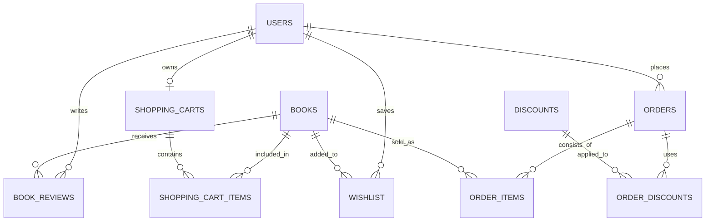

# Online Bookstore Engine

## Overview

This project is an online bookstore built with **Next.js (App Router)**, **React**, **Tailwind CSS**, and **Supabase**. It implements a balanced **SSR (Server-Side Rendering)** and **CSR (Client-Side Rendering)** approach to maximise security, SEO, and interactive performance. The engine integrates authentication, real-time shopping cart management, wishlist tracking, and dynamic search capabilities.

## Project Status

**Current Phase**: Core marketplace MVP (v1) - Feature complete with high test coverage on critical paths  
**Test Coverage**: **77.31% overall** (App: 100%, Components: 100%, Schemas: 100%)  
**Performance**: Lighthouse Desktop 99/100 (0.3s FCP, 0.8s LCP, 0 CLS)  
**Next Priority**: User review submission feature, Stripe payment integration, and enhanced analytics

**This file was created using LLMs to offer an updated version that represents the project's current state.**

## Technical Challenges & Engineering Decisions

### Robust State Architecture

- **The Challenge**: Initial iterations utilised decentralised `useState` hooks, which caused inconsistent UI states and recursive re‑render loops as the Cart and User logic expanded in complexity.
- **The Decision**: Architected a Dual-Context + Reducer pattern to enforce a unidirectional data flow.
    - By decoupling the StateContext (data) from the ActionsContext (dispatch functions), I eliminated unnecessary re-renders. Components like the "Logout" button now trigger actions without being forced to re-subscribe to data changes.
    - Centralized all domain logic within a Reducer to ensure atomic state updates, making the application easier to debug and scale.

### Async Lifecycle Management

- **The Challenge**: Managing loading states for database mutations (Cart/Wishlist) often resulted in inconsistent UI "flickering."
- **The Decision**: Adopted React 19’s useActionState and useTransition.
    - Replaced manual isLoading booleans with native transition hooks, allowing the UI to remain responsive during heavy server-side operations.
    - Implemented a Seeded Initial State pattern. The RootLayout fetches session data on the server and injects it into Client Providers, achieving a Cumulative Layout Shift (CLS) of 0.

### Relational Seeding & Developer Experience

- **The Challenge**: Testing complex e-commerce flows, such as wishlist persistence and review pagination, demanded a high-volume, relational dataset that manual entry or static JSON files could not provide.
- **The Decision**: Developed a custom Automated Seeding Engine powered by `@faker-js/faker`.
    - Implemented a uniqueness‑constraint algorithm for book titles and utilised the `en_GB` locale for realistic, localised testing data.
    - Designed the engine to programmatically associate generated books with a persistent pool of test UUIDs, simulating a real-world social environment with integrated foreign-key relationships.
    - Constructed secure `/api/books` and `/api/reviews` endpoints to bridge the gap between local generation and the Supabase (PostgreSQL) instance.

### Schema-First Validation

- **The Challenge**: Handling multi-step user inputs (shipping profiles, password resets) posed a risk of data corruption and runtime errors if unvalidated data reached the server.
- **The Decision**: Implemented a Schema-First validation layer using Zod integrated with TypeScript.
    - Leveraged Zod's inference capabilities to ensure that form inputs are strictly typed from the Client-Side to the Server Actions.
    - Data is sanitized and validated at the edge, providing immediate UI feedback and ensuring that only "clean" data interacts with the database, significantly hardening the application's security posture.

## Testing & Quality Assurance

The project follows a rigorous testing approach focusing on **Code Coverage** and **Reliability**. Using **Jest v30** and **React Testing Library** with a comprehensive test suite across critical paths.

### Current Coverage Status

| Category       | File Path          | % Statements | % Branch  | % Functions | % Lines   | Status          |
| :------------- | :----------------- | :----------- | :-------- | :---------- | :-------- | :-------------- |
| Total Project  | All Files          | **77.31**    | **95.07** | **78.91**   | **77.31** | ✅ Improving    |
| App Routing    | app/               | 100.00       | 100.00    | 100.00      | 100.00    | ✅ Complete     |
| UI Components  | components/        | 100.00       | 100.00    | 100.00      | 100.00    | ✅ Complete     |
| Data Schemas   | data/schemas/      | 100.00       | 100.00    | 100.00      | 100.00    | ✅ Complete     |
| Auth Actions   | data/actions/auth/ | 100.00       | 100.00    | 100.00      | 100.00    | ✅ Complete     |
| Server Actions | data/actions/      | 44.11        | 80.00     | 50.00       | 44.11     | 🎯 Focus Area   |
| Providers      | providers/         | 77.27        | 66.66     | 50.00       | 77.27     | ⚠️ Needs Work   |
| Data Fetching  | data/books/        | 25.83        | 100.00    | 0.00        | 25.83     | 🔴 Critical Gap |

### Test Strategy

All test files are located in `__tests__/` directory mirroring the source structure:

- **Component Tests**: Comprehensive RTL tests for UI interactions, form submissions, and state changes
- **Action Tests**: Server action validation, error handling, and schema compliance
- **Integration Tests**: Multi-component workflows (auth flow, cart operations, wishlist management)
- **Type Safety**: Full TypeScript coverage ensures compile-time safety across all tests

### Running Tests

```bash
# Run all tests
npm test

# Run with coverage report
npm test -- --coverage

# Watch mode for development
npm test -- --watch

# Run specific test file
npm test -- ComponentName.tsx
```

## Performance Metrics (Lighthouse CLI)

The application is audited to ensure professional‑grade speed and accessibility. Recent optimisations have brought the Desktop performance near‑perfect levels.

| Device      | FCP  | LCP  | TBT   | CLS | Speed Index | Performance | Accessibility | Best Practices | SEO |
| :---------- | :--- | :--- | :---- | :-- | :---------- | :---------- | :------------ | :------------- | :-- |
| **Desktop** | 0.3s | 0.8s | 0ms   | 0   | 0.7s        | 99          | 90            | 96             | 100 |
| **Mobile**  | 1.1s | 2.0s | 130ms | 0   | 2.5s        | 91          | 90            | 96             | 100 |

## Features

#### Core Bookstore Functionality:

- **Book Browsing & Pagination**: Explore books across multiple pages with comprehensive metadata including authors, genres, formats, and publication dates.
- **Advanced Search**: Real-time search bar with debounced queries, case-insensitive partial matching, and instant dropdown results (limited to 10 hits).
- **Multi-Dimensional Filtering**: Filter by genre and book format with instant visual feedback.
- **Flexible Sorting**: Sort books by title, price, release date, and customer ratings. _(Note: "Best Sellers" sort planned for future implementation)_
- **Book Details & Reviews**: Comprehensive product pages with detailed descriptions and dynamic, paginated user reviews (5-star rating system).
- **Wishlist System**: Users can add or remove books from a persistent personalised wishlist with a 10-item limit. Real-time visual feedback on hover.
- **Shopping Cart**: Animated sidebar cart with "Reactive Flip" synchronization logic. Using React 19's `useActionState` hook coordinated with `isPending` state and server-side timestamps, the "Add to Cart" and "Remove" buttons toggle with 100% reliability, accurately reflecting inventory status.
- **Real-time Feedback**: Integrated Notistack toast notification system providing immediate visual feedback for all user interactions (wishlist, cart, authentication).

#### Authentication & User Management:

- **Supabase Email/Password Auth**: Implements secure sign-up, login, and password management with strict validation rules (minimum 8 characters, uppercase, lowercase, digit, and special character required).
- **Profile Management**: Users can update username, shipping address, and password directly through intuitive multi-step forms with Zod schema validation.
- **First-Time Login Flow**: New users must complete their address setup before accessing wishlist and cart features, ensuring data integrity.
- **Real-Time Session Persistence**: Authentication state is managed via Supabase real-time listeners with custom Provider architecture, ensuring seamless cross-device synchronization and avoiding layout shift (CLS = 0).

#### Developer Tools & Administration:

- **Dev-Tools Admin Console** (protected environment): Unlocks powerful utilities including:
    - **Live Telemetry Dashboard**: Real-time system performance and application metrics.
    - **System Logs**: Comprehensive activity and error logging for debugging.
    - **Database Seeding Controls**: One-click database population for development and testing:
        - Generate realistic book data with uniqueness constraints (Faker.js, en_GB locale)
        - Create test users and purchase orders with relational integrity
        - Seed reviews, discounts, and wishlist entries
    - **User Registry**: View and manage test user accounts and credentials.

#### Real-Time Updates & Security:

- **Cross-Device Synchronization**: Supabase real-time listeners and PostgreSQL CDC (Change Data Capture) maintain authentication state and cart sync across all user devices in real-time.
- **Row Level Security (RLS)**: Database-level access control restricts queryable data per authenticated user.
- **Server-Side Auth**: Authentication logic executes on the server using `@supabase/ssr`, keeping sensitive credentials out of client JavaScript.
- **Schema-First Validation**: All user inputs validated via Zod schemas at the edge before database mutations, blocking invalid data.
- **Persistent Data**: User selections (cart, wishlist, profile) stored securely in Supabase, surviving session refreshes and browser closures.

## Technology Stack

- **Frontend**: Next.js (App Router) & React
- **Styling**: Tailwind CSS & MUI (Material UI)
- **Backend**: Supabase (PostgreSQL, Auth, Real-time)
- **State Management**: Centralised React Context (User & Cart Providers)
- **Validation**: Zod (Schema-driven validation)
- **Testing**: Jest & React Testing Library
- **Utility**: Faker.js (used for localised en_GB data seeding via API endpoints)

## Getting Started

### Prerequisites

- Node.js 18+ and npm/yarn
- Supabase account with a PostgreSQL database
- Environment variables configured (see `.env.example`)

### Installation

```bash
# Clone and install dependencies
git clone <repo-url>
cd store
npm install

# Set up environment variables
# Edit .env.local with your Supabase credentials and API keys

# Seed database (optional - use Dev-Tools console)
npm run dev
# Navigate to /dev-tools and use the Database Actions panel
```

### Development

```bash
# Start development server with hot reload
npm run dev

# Run Jest tests with coverage
npm test -- --coverage

# Run specific test file
npm test -- /app/HomePage.tsx

# Build for production
npm run build
npm start
```

### Accessing Dev-Tools

The admin console is available at `http://localhost:3000/dev-tools` during development. Use it to:

- Seed realistic test data
- Monitor system telemetry
- View application logs
- Manage test user accounts

## Database Architecture

The system follows a relational structure designed for e-commerce scalability.

[Database Schema](https://mermaid.ai/live/edit#pako:eNp9kl1vgjAUhv8KOddqRIdo7zYlk2yTBXQmCwlpaNVm0JIWdBv63wdMNt3QXvW0z_uejzaHUBAKCKicMLyWOPa5VqyFZ7mett-322KveVPn-dme3QfjW3fuaUgTO67-cbl25zgPgWu92NaypHaSpbSJW9re9NH25gWj8LYRcdxJGSEtiXBYE6X_pWSShpRtG8mz8gN7bj2VAsbDKCOUBIw3aE5KxKSkUvFN_ZnF1RSh4Clm9aiOLZ02eEoqplIViFVDMeesEhEJ8BXTie2NncWseqlM1SP5Pb0I4ySJWNUrtGAtGQGUyoy2IKYyxmUIeWnmQ7qhMfUBFVuC5ZsPPj8UmgTzVyHiWiZFtt4AWuFIFVGWEJzS4y_7QSgnVI5FxlNAullZAMrhHZDR7wx6NyNzoOs90zAGxeVHwei9TtcYDUemoReXfaN_aMFnlbTbGZrG4QvjP9sp)



## Architecture & Key Patterns

### Dual Context + Reducer Pattern

The application uses a sophisticated state management architecture that prevents unnecessary re-renders and ensures unidirectional data flow:

```
User/Cart Reducer (pure, centralizes all domain logic)
    ↓
UserStateContext / CartStateContext (data only)
UserActionsContext / CartActionsContext (dispatch functions)
    ↓
Components subscribe to what they need
```

**Benefits:**

- Components consuming only actions don't re-render when data changes
- Atomic state updates prevent intermediate inconsistent states
- Server actions dispatch directly to reducers, no useState callbacks
- Real-time Supabase listeners inject updates through same reducer

### Server-First Data Fetching

- **RootLayout** fetches session and initial state on server
- Injects hydrated providers with seeded state (prevents CLS)
- Components receive pre-loaded data, no loading flicker
- React 19's `useActionState` handles mutations seamlessly

### Schema-Driven Type Safety

All user inputs flow through Zod schemas:

```typescript
// Single source of truth for both runtime validation and TypeScript types
const schema = z.object({
    email: z.string().email(),
    password: z.string().min(8),
    // ...
});

type FormData = z.infer<typeof schema>; // Auto-generated type
```

This ensures type safety from form submission to database insert.

### Directory Structure

```
app/              → Server routes and layouts (100% test coverage)
components/       → Reusable UI atoms (100% test coverage)
data/
  ├─ actions/     → Server Actions with Zod validation (44% coverage)
  ├─ books/       → Data fetching queries (21% coverage)
  └─ schemas/     → Zod schemas (100% coverage)
providers/        → Global state (User, Cart contexts) (31% coverage)
utils/
  └─ db/          → Database helpers (admin, client, seed)
__tests__/        → Test suite mirroring src/ structure
```

## Known Limitations

The following features are partially or not yet implemented:

| Feature                | Status             | Notes                                                |
| ---------------------- | ------------------ | ---------------------------------------------------- |
| User Review Submission | 🔶 Partial         | Reviews are read-only; submission UI not implemented |
| Payment Processing     | ❌ Not Implemented | Checkout UI ready, Stripe API integration pending    |
| Admin Dashboard        | 🔶 Partial         | Dev-tools exist, full admin interface pending        |
| Order History          | ❌ Not Implemented | Database schema exists, UI pending                   |
| Discount Application   | 🔶 Partial         | Logic exists, frontend form pending                  |

## Future Roadmap

#### 1. Core E-Commerce Completion

- [ ] **User Review Submission**: Add UI and Server Actions to allow authenticated users to submit and rate books (currently read-only).
- [ ] **Stripe Payment Integration**: Implement a secure checkout flow using Stripe Elements and Server Actions.
- [ ] **Order Success Workflow**: Automate post-purchase triggers, including the generation of dynamic receipts and email confirmations.
- [ ] **Inventory Auto-Update**: Logic to decrement `stock_quantity` in the `books` table automatically upon successful purchase.

#### 2. Enhanced User Experience

- [ ] **Optimistic UI Updates**: Leverage React 19's `useOptimistic` hook for "Add to Cart" and "Wishlist" actions to provide instantaneous visual feedback while background processes resolve.
- [ ] **Advanced Multi-Select Filtering**: Support simultaneous filtering by multiple genres and price ranges with real-time result updates.
- [ ] **Skeleton Loading States**: Implement shimmering MUI Skeleton components to replace basic loading spinners during SSR data fetching, improving perceived performance.
- [ ] **Image Optimisation**: Implement Next.js Image component with WebP conversion and responsive srcset for book cover art.

#### 3. Advanced Store Features

- [ ] **Discount & Promo Logic**: Implement server-side validation service to check the discounts table for expiry, usage limits, and user eligibility before applying final order totals.
- [ ] **Bestseller Gallery Section**: Homepage showcase driven by aggregate SQL queries of `order_items` and real-time sales rankings.
- [ ] **Related Books Discovery**: Product page section suggesting similar books using PostgreSQL similarity functions based on shared genres, authors, and user ratings.
- [ ] **Personalised Recommendations**: ML-driven product recommendations based on browsing history, wishlist patterns, and purchase behaviour.
- [ ] **Email Notifications**: Transactional emails for order confirmations, wishlist alerts, and promotional offers using SendGrid or similar service.

#### 4. Admin & Operations

- [ ] **Inventory Management Dashboard**: Protected admin interface using Supabase Custom Claims to manage stock levels, pricing, and book metadata.
- [ ] **Review Moderation System**: Administrative queue to flag inappropriate reviews and monitor community sentiment with moderation workflows.
- [ ] **Enhanced Audit Logs**: Comprehensive tracking of all administrative changes to book catalog, user profiles, and pricing for compliance and security.
- [ ] **Role-Based Access Control (RBAC)**: Expand permission system to include "Moderator," "Editor," and "Finance" roles with granular feature access.
- [ ] **Sales Analytics Dashboard**: Real-time charts and metrics tracking revenue, top-selling books, user acquisition, and seasonal trends.
- [ ] **Bulk Operations**: Import/export functionality for managing book catalogs and customer data in CSV format.

#### 5. Security & Compliance Enhancements

- [ ] **Centralized Error Handler**: Create a centralized error handling system that sanitizes all Supabase error messages before client exposure to prevent information leakage.
- [ ] **Rate Limiting**: Implement distributed rate limiting on authentication endpoints to prevent brute force attacks and credential stuffing.
- [ ] **Security Audit Logging**: Add comprehensive logging for sensitive operations like password changes, failed authentication attempts, and administrative actions.
- [ ] **Security Headers**: Implement security headers (CSP, HSTS, X-Frame-Options, etc.) via Next.js configuration and middleware for enhanced protection.
- [ ] **Advanced Input Validation**: Expand Zod schema validation with custom sanitization rules and continue the schema-first validation pattern for all user inputs.
