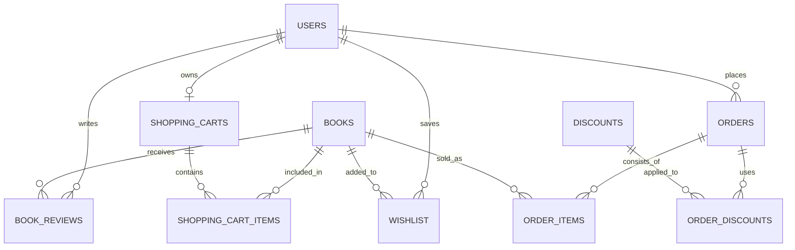

# Online Bookstore Engine

## Overview

This project is a full-stack online bookstore built as a personal engineering project. It combines a Next.js App Router frontend, React 19 interactive components, Supabase authentication and PostgreSQL persistence, MUI/Tailwind styling, schema-first validation, and a deliberately testable service architecture.

The application is designed around a server-first model: route-level data and authenticated state are loaded on the server where possible, then hydrated into focused client providers for interactions that need local state. The result is a storefront with searchable catalog content, advanced filtering, reviews, cart and wishlist workflows, public sharing features, and development tooling for realistic database data.

This README documents both what is implemented and what is intentionally still incomplete. A high test percentage describes the behavior represented by the test suite; it does not imply that planned product areas such as payment or checkout already exist.

## Project Status

**Current Phase**: Core bookstore paths implemented; checkout and payment remain the next product milestone
**Last Verified**: September 6, 2026
**Test Run**: 182 suites passed, 1,334 tests passed, 1 snapshot passed
**Coverage**: 100.00% statements, branches, functions, lines, and average
**Quality Checks**: `npm run lint` and `npm run build` pass

### Verification Snapshot

| Check | Result |
| :---- | :----- |
| Jest suites | 182 passed / 182 total |
| Jest tests | 1,334 passed / 1,334 total |
| Snapshots | 1 passed / 1 total |
| Statements | 100.00% |
| Branches | 100.00% |
| Functions | 100.00% |
| Lines | 100.00% |
| ESLint | Passed with no reported errors |
| Production build | Passed, including TypeScript verification |

## Technology Stack

### Application

- **Next.js 16.3.4** with the App Router and server-rendered route components
- **React 19** with `useActionState`, `useOptimistic`, and transition-based pending states
- **TypeScript** with strict compiler settings, path aliases, and generated database types
- **Tailwind CSS 4** and **Material UI 9** for layout, forms, responsive components, and feedback states

### Backend and Persistence

- **Supabase SSR** for authenticated server/browser clients and session-aware rendering
- **Supabase JavaScript client** for PostgreSQL data access and Realtime subscriptions
- **PostgreSQL** for books, reviews, users, carts, wishlist records, orders, discounts, and related entities
- **Supabase Row Level Security** for user-owned data boundaries

### Supporting Libraries

- **Zod 4** for runtime validation and inferred TypeScript types
- **Jest 30.1.3** with the V8 coverage provider
- **React Testing Library 16.3.0** for component and interaction tests
- **Faker 10** for realistic development and seed data
- **Notistack** for application feedback notifications
- **use-debounce** for catalog search behavior
- **react-intersection-observer** for intersection-driven UI behavior

## Implemented Features

### Catalog and Book Discovery

The storefront supports a complete read-oriented catalog experience:

- Server-rendered homepage book listing with pagination
- Book detail pages at `/book/[slug]`
- Book metadata including title, authors, publisher, publication date, format, genre, page count, price, stock, and ratings where available
- Next Image optimization for book artwork
- Related-book discovery on detail pages
- Bestseller ordering using the `sales_count` value
- Sorting by title, price, release date, customer rating, and bestseller ranking
- Advanced filtering by available book attributes such as genre, format, author, price, and rating
- Breadcrumbs, result counts, loading states, empty states, and error states

Primary implementation areas:

- [app/page.tsx](app/page.tsx)
- [app/book/[slug]/page.tsx](app/book/[slug]/page.tsx)
- [data/books/](data/books/)
- [data/advancedFiltering/](data/advancedFiltering/)
- [components/FilteringSidebar/](components/FilteringSidebar/)
- [components/books/](components/books/)

### Search

The search bar is implemented as an interactive, abortable search workflow:

- Case-insensitive partial title matching
- Debounced input handling
- Keyboard navigation with arrow keys, Enter, and Escape
- Loading feedback while results are being resolved
- Error handling for failed searches
- Maximum of ten suggestions in the result dropdown
- Abort behavior when a pending request is no longer relevant

Primary implementation areas:

- [components/layout/UserNavbar/SearchBar/](components/layout/UserNavbar/SearchBar/)
- [hooks/SearchBar/](hooks/SearchBar/)

### Reviews

Reviews are no longer read-only. The implemented review lifecycle includes:

- Paginated review display on book pages
- Rating and reviewer information
- Review submission for authenticated users with completed profiles
- Rating input and comment input components
- Server-side validation before insertion
- User review management at `/user/content/reviews`
- Editing and deleting a user's own reviews
- Authorization checks around review mutations
- Security audit events for relevant review access and mutations

Primary implementation areas:

- [app/book/[slug]/components/Reviews/](app/book/[slug]/components/Reviews/)
- [app/user/content/reviews/](app/user/content/reviews/)
- [data/books/reviews/](data/books/reviews/)

### Authentication and Onboarding

Authentication is implemented with Supabase email/password auth and server-aware session handling:

- Registration and sign-in actions
- Password changes with current-password verification
- Password rules requiring 8-50 characters, uppercase, lowercase, number, and special character
- Server-side session validation
- Browser auth state listeners
- Profile synchronization after authentication changes
- First-time onboarding that requires a completed address before protected commerce and review actions
- Profile details, username, address, date of birth, phone, and password workflows

Primary implementation areas:

- [data/auth/](data/auth/)
- [app/user/auth/](app/user/auth/)
- [app/user/profile/](app/user/profile/)
- [data/user/onboarding/](data/user/onboarding/)
- [utils/db/](utils/db/)

### User Profiles and Public Identity

The private profile area provides account-focused actions and profile maintenance. A username-based public route is also implemented:

- Private profile page at `/user/profile`
- Username update validation and persistence
- Public profile page at `/user/[username]`
- Public profile banner with user-facing identity information
- Explicit unavailable state when a profile cannot be resolved
- Quick actions from the private profile area

The public profile route is intentionally narrower than a full social profile. Visibility controls and public content sections remain roadmap work; the existence of the route does not mean every profile privacy feature is complete.

### Shopping Cart

The cart is a reducer-backed, real-time workflow:

- Cart creation for authenticated users
- Add, update, remove, and clear operations
- Quantity controls with validation and boundaries
- Animated cart sidebar and cart summary
- Subtotal, tax-related display, and total calculations where applicable
- Pending, disabled, empty, and error states
- Optimistic feedback for responsive interactions
- Server actions backed by validated cart schemas
- Supabase listener refreshes after relevant database changes
- Cart state reset and refresh during authentication transitions

Primary implementation areas:

- [components/CartSidebar/](components/CartSidebar/)
- [components/CartForms/](components/CartForms/)
- [data/cart/](data/cart/)
- [providers/cart/](providers/cart/)

#### Checkout Boundary

The cart currently navigates toward `/checkout`, but `/checkout` is not present in the verified production route list. Therefore the following are not represented as customer-facing workflows yet:

- Payment provider integration
- Checkout form and payment confirmation
- Atomic order creation after payment
- Receipt or order-success workflow
- Post-payment inventory decrement
- Customer order history

Order-related records and seed utilities exist in the data model, but they should not be confused with a finished checkout system.

### Wishlist and Sharing

The wishlist supports both personal storage and controlled sharing:

- Add and remove books for authenticated users
- Ten-item limit enforcement
- Persistent wishlist state through the user provider
- Public sharing through a username-based route
- Private sharing through a generated token route
- Visibility toggle between public and private modes
- Private token regeneration to revoke an earlier link
- Restricted/unavailable states for invalid, revoked, disabled, or missing shared wishlists
- Real-time synchronization through user listeners

Primary implementation areas:

- [app/user/wishlist/](app/user/wishlist/)
- [app/user/wishlist/components/WishlistSharing/](app/user/wishlist/components/WishlistSharing/)
- [data/user/wishlist/](data/user/wishlist/)

### Navigation and Information Pages

The shared layout provides a consistent storefront shell:

- Header and brand area
- User navigation with search, profile, authentication, and cart actions
- Filter navigation and advanced filtering sidebar
- Breadcrumb navigation
- Responsive drawers and form layouts
- Loading skeletons and error states
- Footer links to legal and informational content

Implemented information routes include:

- `/infos/privacypolicy`
- `/infos/returnpolicy`
- `/infos/shippinginfo`
- `/infos/tos`

### Development Console and Seed Data

The `/dev-tools` route is a development-only console. It redirects away in production and provides:

- Live telemetry and system status presentation
- System log output
- Database action controls
- User registry views
- Additive seed operations
- Reset-oriented database controls

Seed utilities generate relationally connected development data for:

- Books
- Users
- Reviews
- Orders and order items
- Discounts and order discounts
- Shopping carts and cart items
- Wishlist entries

These tools are useful for local development and test data generation. They are not a production admin dashboard, inventory console, moderation queue, or role-based operations system.

## Architecture

### Server-First Rendering with Interactive Islands

The route tree uses server components and server-side data access for catalog, profile, and authenticated boundary decisions. Client components are used where interaction requires browser state, including search, filters, cart controls, wishlist actions, review forms, and provider consumers.

This split gives the application:

- Server-side authentication and authorization decisions
- SEO-capable book and information pages
- Smaller client responsibilities for read-oriented content
- Interactive controls without moving the entire route into client rendering
- A clear boundary between data services/server actions and UI components

### Provider Composition

The root provider tree composes session support, notifications, book sorting, advanced filtering, cart state, and user state. The root layout obtains initial authenticated data and seeds providers before interactive components render.

The primary flow is:

```text
Root layout
    |
    +-- Server session, user profile, and cart lookup
    |
    +-- Root layout content
            |
            +-- Session provider
            +-- Notification provider
            +-- Book sorting provider
            +-- Advanced filtering provider
            +-- Cart provider
            +-- User provider
                    |
                    +-- Interactive route components
```

### Dual Context + Reducer Pattern

Cart and user providers separate state from actions. Reducers centralize domain transitions, while state and action contexts allow components to subscribe only to the part of the provider contract they need.

```text
Pure reducer
    |
    +-- State context: current user/cart data
    +-- Actions context: refresh and dispatch operations
                |
                +-- Components subscribe to the smallest required surface
```

This design addresses several practical problems:

- Action-only components do not re-render for unrelated state changes
- State transitions are explicit and testable
- Server actions and Realtime listeners can converge on the same reducer path
- Logout, reset, refresh, and error states have centralized behavior
- Prop drilling is avoided for application-wide state

### Server-Seeded Initial State

`RootLayoutContent` loads session, user, and cart data on the server and passes the result into providers. This prevents the first browser render from showing a false anonymous, empty-cart, or loading state when the server already knows the authenticated state.

The tradeoff is that the root layout depends on the availability and correctness of the Supabase request context. Provider listeners still remain responsible for changes after hydration, such as sign-in, sign-out, profile changes, and cross-device mutations.

### Service and Repository Boundaries

The data layer separates responsibilities across several layers:

- **Schemas** define accepted input and constraints
- **Actions** expose mutation entry points to forms and routes
- **Services** coordinate business operations and authorization-aware behavior
- **Repositories** perform focused database queries
- **Mappers** convert database records into application/domain shapes
- **Providers and components** render state and dispatch user intent

This is especially visible in cart, user, and review modules. It keeps database query details out of most UI components and makes service behavior independently testable.

### Schema-First Validation

Zod schemas are used as the runtime boundary before mutations reach Supabase. The same schemas provide inferred TypeScript types where appropriate.

The validation strategy covers:

- Authentication credentials and password rules
- User onboarding and address fields
- Cart operation types and quantity limits
- Review rating and comment fields
- Wishlist mutations and sharing operations
- Normalization and boundary checks for user-controlled values

### Real-Time Synchronization

Supabase listeners refresh provider state when relevant records change. Cart listeners handle cart item changes, while user listeners cover authentication, profile, and wishlist changes.

The synchronization approach favors authoritative refreshes after a mutation rather than relying only on optimistic client assumptions. Optimistic UI is used for responsiveness, but server state remains the source of truth.

## Data Model

The persistence model is relational and centered around users, books, and commerce relationships:


```mermaid
erDiagram
    USERS ||--o| SHOPPING_CARTS : owns
    USERS ||--o{ BOOK_REVIEWS : writes
    USERS ||--o{ WISHLIST : saves
    USERS ||--o{ ORDERS : places
    BOOKS ||--o{ BOOK_REVIEWS : receives
    BOOKS ||--o{ SHOPPING_CART_ITEMS : included_in
    BOOKS ||--o{ WISHLIST : added_to
    SHOPPING_CARTS ||--o{ SHOPPING_CART_ITEMS : contains
    ORDERS ||--o{ ORDER_ITEMS : consists_of
    BOOKS ||--o{ ORDER_ITEMS : sold_as
    ORDERS ||--o{ ORDER_DISCOUNTS : uses
    DISCOUNTS ||--o{ ORDER_DISCOUNTS : applied_to
```

The current implementation actively uses the book, user, review, cart, wishlist, and sharing parts of this model. Orders and discounts are also represented in seed/repository code, but customer-facing checkout, order history, and discount application are not complete.

## Usability and Interaction Design

The application includes usability-oriented behavior across common storefront workflows:

- Search suggestions are limited to ten results to keep the dropdown scannable
- Search supports keyboard movement and Escape dismissal
- Forms expose validation, pending, success, and error states
- Cart and wishlist controls provide optimistic feedback while server operations complete
- Cart quantity controls prevent invalid or concurrent updates during pending operations
- Empty cart, empty wishlist, unavailable profile, unavailable shared wishlist, and failed data states have dedicated UI paths
- Breadcrumbs provide orientation within book and filtered browsing routes
- Sticky/filter navigation keeps catalog controls available during browsing
- Toast feedback communicates completed or failed user actions
- Development-only destructive actions use dedicated controls and pending-state handling

The application uses MUI and Tailwind rather than introducing a second bespoke component system. Shared form fields, buttons, error displays, popovers, tooltips, skeletons, drawers, and breadcrumb components keep interaction patterns consistent.

## Accessibility Posture

Accessibility is treated as an implementation concern, but a complete WCAG audit has not been performed or documented. The current codebase includes:

- Keyboard navigation in search suggestions
- Focusable form controls and action buttons
- Disabled states while asynchronous actions are pending
- Dedicated error and unavailable states instead of silent failures
- Semantic route-level headings and form structures in the implemented pages
- Tooltips and icon states for compact controls where applicable
- Responsive layouts for desktop and mobile presentation

Remaining accessibility work includes a systematic WCAG 2.1 audit, explicit ARIA review, screen-reader verification, focus-management review for dialogs/drawers, and keyboard testing across every interactive route. The repository's 100% code coverage does not certify accessibility compliance.

## Security and Data Protection

### Authentication and Authorization

- Supabase SSR is used for server-aware authentication
- Browser and server clients are separated in [utils/db/](utils/db/)
- Middleware refreshes and validates session context
- Server actions check authentication before protected mutations
- User-owned data is protected by Supabase RLS policies
- Shared wishlist routes apply visibility/token rules before returning data

### Input and Error Safety

- Zod validates user input before database operations
- Shared error handling normalizes Supabase and authentication failures
- Safe query wrappers provide a common error boundary for database calls
- Security audit metadata is sanitized before recording
- Unauthorized access paths are logged where the relevant service supports it

### Response Security

[next.config.ts](next.config.ts) configures:

- Content Security Policy
- Strict Transport Security
- X-Frame-Options
- X-Content-Type-Options
- Referrer-Policy
- Permissions-Policy
- Disabled powered-by header
- Compressed responses
- Restricted remote image patterns

### Security Gaps

The following are not complete in the current application tree:

- Distributed rate limiting for authentication and sensitive mutations
- Production admin audit-log dashboard
- Granular production RBAC
- Full client/server/database exception observability pipeline
- Formal security and accessibility audit evidence

## Testing and Quality Assurance

### Test Organization

Tests are organized by behavior and source area:

- `__tests__/app/` for route and page behavior
- `__tests__/components/` for reusable UI and interaction behavior
- `__tests__/data/` for repositories, services, actions, mappers, and schemas
- `__tests__/hooks/` for custom hook behavior
- `__tests__/providers/` for reducer/provider/listener behavior
- `__tests__/utils/` for error, database, and security utilities
- `__mocks__/` for framework and server-boundary mocks

The test suite includes focused coverage for authentication, cart operations, wishlist sharing, public profiles, review forms and actions, filtering, search cancellation, provider synchronization, error normalization, and development tools.

### Current Coverage

Coverage is generated with Jest's V8 provider using [jest.config.ts](jest.config.ts). The collected surface includes application routes, components, data, providers, hooks, security utilities, error utilities, and the safe Supabase query wrapper. The root layout and global CSS are excluded from collection.

| Metric | Coverage | Status |
| :----- | :------: | :----- |
| Statements | 100.00% | ✅ Complete |
| Branches | 100.00% | ✅ Complete |
| Functions | 100.00% | ✅ Complete |
| Lines | 100.00% | ✅ Complete |
| Average | 100.00% | ✅ Complete |

Configured global thresholds are:

```text
Branches: 99%
Functions: 95%
Lines: 90%
Statements: 90%
```

The latest `npm run test:report` run passed 182 suites, 1,334 tests, and 1 snapshot. Coverage should be interpreted as evidence that represented code paths are exercised, not as evidence that unimplemented product areas are finished.

### Verification Commands

```bash
# Run tests, collect coverage, and regenerate test-summary.json
npm run test:report

# Run Jest with coverage
npm test

# Run Jest in watch mode
npm run test:watch

# Run ESLint
npm run lint

# Create the optimized production build
npm run build

# Start the production server after a successful build
npm start
```

## Build and Route Verification

The verified production build completed successfully with TypeScript verification and static page generation. It reported these application routes:

```text
/
/_not-found
/book/[slug]
/dev-tools
/infos/privacypolicy
/infos/returnpolicy
/infos/shippinginfo
/infos/tos
/user/[username]
/user/auth/change_password
/user/auth/signin
/user/auth/signup
/user/content/reviews
/user/profile
/user/profile/change_address
/user/wishlist
/user/wishlist/shared/[username]
/user/wishlist/shared/token/[token]
```

The build also included the middleware proxy. The route output confirms the current public surface and, importantly, confirms that `/checkout` is not currently an application route.

## Directory Structure

```text
Store Project Root
├── app/                 Next.js App Router routes, layouts, actions, and route components
│   ├── book/[slug]/     Book details, related books, and review submission
│   ├── dev-tools/       Development-only telemetry, seeding, and registry console
│   ├── infos/           Privacy, return, shipping, and terms pages
│   └── user/            Auth, profile, public profile, reviews, wishlist, and sharing routes
├── components/          Shared storefront, cart, filtering, layout, form, and UI components
│   ├── books/           Book cards, book managers, ratings, and wishlist actions
│   ├── CartForms/       Cart mutation and quantity forms
│   ├── CartSidebar/     Cart drawer, summary, items, and removal controls
│   ├── FilteringSidebar Advanced catalog filtering UI
│   ├── formItems/       Shared validated form fields
│   ├── layout/          Header, footer, navbar, filters, and root content
│   └── ui/              Breadcrumbs, tooltips, popovers, errors, and primitives
├── data/                Repositories, services, server actions, schemas, and constants
│   ├── advancedFiltering Filtering rules and filter constants
│   ├── auth/            Authentication actions
│   ├── books/           Book queries, mapping, sorting, and reviews
│   ├── cart/            Cart queries, mapping, and mutations
│   ├── schemas/         Zod validation schemas
│   └── user/            User, onboarding, profile, and wishlist operations
├── hooks/               Custom hooks, including book search
├── providers/           Sorting, filtering, cart, user, and root providers
├── utils/               Database clients, safe queries, errors, security, and seed utilities
├── public/              Static assets
├── supabase/            Supabase project configuration
├── __tests__/            App, component, data, hook, provider, and utility tests
├── __mocks__/            Jest mocks
├── database.types.ts    Generated database TypeScript types
├── jest.config.ts       Jest and coverage configuration
├── next.config.ts       Images, compression, and security headers
├── package.json         Scripts and dependency declarations
└── test-summary.json    Generated coverage summary
```

## Getting Started

### Prerequisites

- Node.js and npm
- A configured Supabase project for the application's database, authentication, and realtime behavior
- The project's declared dependencies installed locally

### Install Dependencies

```bash
npm install
```

### Start Development

```bash
npm run dev
```

Open the local Next.js development server in a browser. The development console is available at `/dev-tools` and can be used to generate relational test data, inspect telemetry, and exercise development database controls.

### Production Verification

```bash
npm run test:report
npm run lint
npm run build
npm start
```

The commands above reproduce the documented test, lint, and build verification sequence.

## Known Limitations

### Commerce Completion

- The cart points to `/checkout`, but no checkout route is implemented
- Payment processing is not integrated
- Order creation after successful payment is not implemented as a customer workflow
- Receipt and order-success handling is not implemented
- Inventory decrement after purchase is not implemented
- Customer-facing order history is not implemented

### Discounts and Promotions

- Discount records and seed generation exist
- Order-discount relationships exist in the data/seed surface
- Customer-facing discount entry, eligibility checks, expiry checks, usage limits, and final checkout calculation are not implemented

### Administration and Operations

- `/dev-tools` is a development console, not a production admin dashboard
- Production RBAC is not implemented
- Inventory management is not implemented
- Review moderation queues are not implemented
- Production audit-log browsing is not implemented
- Sales analytics and bulk catalog operations are not implemented

### Public Identity

- The public profile route and banner are implemented
- Profile visibility controls remain incomplete
- Public profile reviews, wishlist sections, recommendations, editing, and privacy settings remain future work

### Security, Accessibility, and Observability

- Distributed rate limiting is not present
- A full WCAG 2.1 audit has not been completed
- No current Lighthouse benchmark is included in the verified outputs
- A complete production exception-logging and observability pipeline is not implemented

## Roadmap

### 1. Checkout and Commerce Completion

- [ ] Add the `/checkout` route
- [ ] Integrate a payment provider through server-side actions
- [ ] Validate stock and create orders atomically after payment confirmation
- [ ] Add order-success, receipt, and email-confirmation workflows
- [ ] Decrement inventory after successful purchase
- [ ] Add protected customer order history
- [ ] Add server-validated discount and promotion application

### 2. Public Profiles and Community Features

- [ ] Add profile visibility controls
- [ ] Define and expose public profile content sections
- [ ] Add public reviews with privacy-aware access rules
- [ ] Add public wishlist presentation within the profile model
- [ ] Add public recommendations
- [ ] Add public profile editing and privacy settings

### 3. Store Operations

- [ ] Build protected production administration
- [ ] Add Supabase Custom Claims or equivalent role enforcement
- [ ] Add inventory management
- [ ] Add order and discount management
- [ ] Add review moderation workflows
- [ ] Add audit-log browsing and filtering
- [ ] Add sales analytics
- [ ] Add bulk catalog/customer import and export

### 4. Experience and Accessibility

- [ ] Run a complete WCAG 2.1 audit
- [ ] Review ARIA roles, labels, announcements, and focus management
- [ ] Test dialogs, drawers, forms, search, and filters with keyboard-only interaction
- [ ] Verify screen-reader behavior for asynchronous feedback and validation errors
- [ ] Generate reproducible desktop and mobile performance benchmarks

### 5. Security and Reliability

- [ ] Add distributed rate limiting to authentication and sensitive mutation paths
- [ ] Extend security audit coverage to production administration actions
- [ ] Add centralized server, client, and database exception logging
- [ ] Preserve sanitized query/authentication context in operational logs
- [ ] Keep generated metrics and documentation synchronized after meaningful changes

## Engineering Decisions and Tradeoffs

### Why Supabase

Supabase provides PostgreSQL persistence, authentication, row-level security, and realtime subscriptions in one backend platform. This fits the project's goals as a personal full-stack bookstore while keeping authorization close to the data model.

The tradeoff is that application behavior depends on both Next.js request context and Supabase policies. The code therefore maintains separate server/browser clients, explicit authorization checks, safe query wrappers, and provider refresh logic.

### Why Server Actions

Server actions keep sensitive mutations and authorization checks away from client-only code. They provide a direct form-to-server path for authentication, cart, wishlist, onboarding, and review operations.

The tradeoff is that pending, validation, and server error states must be modeled carefully in client forms. React 19 action-state and transition APIs are used to make those states explicit.

### Why Reducers Instead of Scattered Local State

Cart and user state have multiple update sources: initial server data, form mutations, authentication events, and Realtime changes. Reducers provide one transition model for these sources and make resets, refreshes, loading, and errors testable.

### Why Separate State and Action Contexts

Separating contexts reduces subscriptions for components that only dispatch operations. It also makes the provider API clearer: consumers can request state, actions, or both rather than receiving one broad mutable object.

### Why Seeded Development Data

A bookstore's meaningful workflows depend on relational data volume: books with reviews, users with profiles, carts with items, orders with items, and discounts linked to sales. Faker-based seed utilities make those relationships reproducible enough for development and visual testing without requiring hand-created records.

## Conclusion

This repository is a deeply tested Next.js bookstore foundation rather than a claim of a finished commerce business. It already demonstrates catalog discovery, server-aware authentication, profile onboarding, reviews, cart state, wishlist sharing, realtime synchronization, schema validation, development tooling, and security-oriented boundaries.

The next meaningful milestone is the missing commerce boundary: checkout, payment, order creation, inventory updates, discount application, and order history. Once that boundary exists, production administration, public-profile expansion, accessibility verification, rate limiting, and operational observability can build on the architecture already in place.
