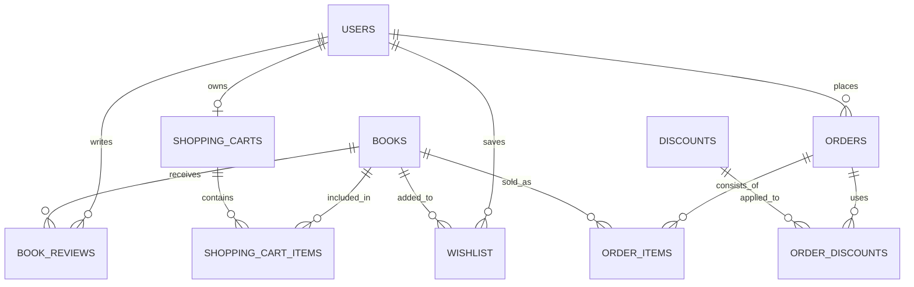

# Online Bookstore Engine

## Overview

### Application Overview

Books4You is a full-stack online bookstore application for readers who want to discover, compare, review, save, and purchase books. The product combines a searchable and filterable catalog with individual book pages, reader reviews, customer accounts, wishlists and share links, a shopping cart, and a Stripe card checkout flow. Its business value is an end-to-end digital storefront foundation: product discovery and community features connect to checkout, order records, and customer order views.

This repository is a software project, not a claim of a fully operated retail service. Real deployment depends on a correctly configured Supabase project/database, secure environment settings, Stripe configuration, verified database policies/functions, and remediation of the production-readiness limitations documented below.

## Project Status

**Status:** Feature-complete application prototype with catalog, accounts, cart, checkout, and order routes implemented; production commerce hardening remains outstanding.
**Last verified:** October 7, 2026 (local workspace verification).
**Automated verification:** 234 Jest suites passed, 1,704 tests passed, one snapshot passed; ESLint passed; production build passed.
**Coverage:** 100% statements, branches, functions, and lines in Jest's configured collection (not all runtime/configuration/infrastructure behavior).

### Verification Snapshot

| Check | Result |
| :---- | :----- |
| Jest suites | 234 passed / 234 total |
| Jest tests | 1,704 passed / 1,704 total |
| Snapshots | 1 passed / 1 total |
| Statements | 100% (configured collection) |
| Branches | 100% (configured collection) |
| Functions | 100% (configured collection) |
| Lines | 100% (configured collection) |
| ESLint | Passed |
| Production build | Passed; route generation and TypeScript verification completed |

Coverage configuration is in [jest.config.ts](jest.config.ts). It covers configured application, component, data, provider, hook, and selected utility sources; root layout/global CSS are excluded and top-level proxy/deployment behavior and live external systems are not covered by that percentage. Tests are predominantly unit/component tests with mocked external services; see [Testing and Quality Assurance](#testing-and-quality-assurance).

### Lighthouse Benchmark

The repository contains generated reports at `lighthouse-desktop.report.html` / `.json` and `lighthouse-mobile.report.html` / `.json`. Their recorded category scores are:

#### Desktop

| Metric | Score |
| :----- | :---: |
| Performance | 99 |
| Accessibility | 90 |
| Best Practices | 96 |
| SEO | 100 |

#### Mobile

| Metric | Score |
| :----- | :---: |
| Performance | 71 |
| Accessibility | 90 |
| Best Practices | 96 |
| SEO | 100 |

These are existing report artifacts and were not regenerated during this audit. Lighthouse scores are snapshots, vary with runtime/environment, and do not prove WCAG compliance. The mobile performance score warrants follow-up measurement. Regenerate reports after a production build with `npm run build:audit`.

## Technology Stack

### Application

- **Next.js 16 App Router** for server-rendered routes, Server Actions, route handlers, and the `proxy.ts` request hook.
- **React 19** for interactive components, reducers/context providers, and transition-based UI.
- **TypeScript** in strict mode with generated Supabase database types and the `@/*` project alias.
- **Tailwind CSS 4** and **Material UI 9** for responsive layout, controls, and interaction feedback.

### Backend and Persistence

- **Supabase Auth and `@supabase/ssr`** for email/password authentication and cookie-aware server/browser clients.
- **Supabase JavaScript client / PostgreSQL** for catalog, customer, cart, wishlist, review, order, and discount data.
- **Supabase Realtime** listeners for user/cart synchronization.
- **Stripe** and Stripe Elements for PaymentIntent-based card checkout and webhook updates.
- **hCaptcha** token integration on authentication forms (requires matching Supabase CAPTCHA configuration).

### Supporting Libraries

- **Zod 4** for server-side runtime schema validation.
- **Jest 30** and **React Testing Library 16** for unit/component testing with V8 coverage.
- **ESLint 9** with Next.js Core Web Vitals configuration.
- **Faker 10** for development seed data.
- **Notistack**, `use-debounce`, `react-intersection-observer`, and Vercel Analytics for notifications, search/UI behavior, and analytics.

## Tech Stack & Architecture

The application uses a server-first Next.js App Router design. Server route components retrieve catalog/account data; interactive UI islands handle search, filtering, cart, wishlist, review forms, and checkout. Data mutations are generally routed through server actions into domain services and repositories. Supabase/PostgreSQL is the persistence layer; Stripe handles card payment processing.

```text
Next.js route / UI
   ├── Server-rendered route reads
   └── Client UI + reducer/context state
          │ Server Actions / route handlers
          ▼
     Zod validation → domain services → repositories
          ├── Supabase Auth / PostgreSQL / Realtime
          └── Stripe PaymentIntents / signed webhooks
```

Important implementation areas:

- [app/](app/) — route segments, pages, checkout and webhook handlers.
- [components/](components/) — shared layout, catalog, cart, forms, filters, and UI.
- [data/](data/) — schemas, actions, services, repositories, mappers, and domain types.
- [providers/](providers/) — cart/user reducers and shared catalog state.
- [utils/](utils/) — Supabase clients, error handling, rate limiting, retry behavior, audit logging, and seed helpers.
- [database.types.ts](database.types.ts) — generated TypeScript database declarations. It does not include executable SQL schema/migration definitions.

### Backend and Database Configuration Caveat

The application expects Supabase tables and RPC functions, including order/inventory transaction procedures, but this repository does not include a committed SQL migration/schema set under `supabase/`. Supabase RLS policies, constraints, triggers, and RPC implementation therefore cannot be verified or reproduced from this repository alone. Obtain or create versioned migrations and test them before deploying or using real customer data.

## Implemented Features

### Catalog and Book Discovery

- Server-rendered homepage catalog and bestseller carousel.
- Book detail route at `/book/[slug]`, with metadata, price/stock, reviews, and related books.
- Sorting and filtering across catalog attributes; pagination and explicit loading/error/empty states.
- Image optimization configured for AVIF/WebP.
- Relevant code: [app/page.tsx](app/page.tsx), [app/book/](app/book/), [data/books/](data/books/), [data/advancedFiltering/](data/advancedFiltering/).

### Search

- Debounced, case-insensitive partial title search.
- Keyboard navigation, loading/error feedback, bounded suggestions, and cancellation of obsolete requests.
- Relevant code: [components/layout/UserNavbar/SearchBar/](components/layout/UserNavbar/SearchBar/), [hooks/SearchBar/](hooks/SearchBar/).

### Reviews

- Paginated book reviews and ratings.
- Authenticated review submission for eligible/profile-complete users.
- User review management route with edit/delete capabilities and server-side ownership checks.
- Relevant code: [app/book/[slug]/components/Reviews/](app/book/[slug]/components/Reviews/), [app/user/reviews/](app/user/reviews/), [data/books/reviews/](data/books/reviews/).

### Authentication and Onboarding

- Supabase email/password signup, sign-in, and password change.
- CAPTCHA token integration, input validation, and authentication/security audit events.
- Server-aware session loading and client auth-state synchronization.
- User onboarding/profile details including identity, address, date of birth, phone, and username.
- Relevant code: [app/user/auth/](app/user/auth/), [app/user/profile/](app/user/profile/), [data/auth/](data/auth/), [data/user/onboarding/](data/user/onboarding/).

### User Profiles and Public Identity

- Private profile and address management.
- Public profile route at `/user/profile/public/[username]`.
- Profile privacy settings UI; public identity/content scope remains limited and needs dedicated access-control verification.
- Relevant code: [app/user/profile/](app/user/profile/), [data/user/profile/](data/user/profile/).

### Shopping Cart

- Authenticated cart creation and add/update/remove/clear operations.
- Quantity controls, summary, sidebar, optimistic feedback, and Supabase state refresh.
- Reducer/context-backed client state seeded from server data.
- Relevant code: [data/cart/](data/cart/), [providers/cart/](providers/cart/), [components/CartSidebar/](components/CartSidebar/), [components/CartForms/](components/CartForms/).

#### Checkout Boundary

Checkout is implemented at `/checkout` with shipping/address entry, discount entry, shipping methods, Stripe card Elements, server-side book price/stock lookup, order creation through a database RPC, and a PaymentIntent flow. `/checkout/success`, `/user/orders`, and `/user/order/[orderId]` provide order confirmation/history views. `/api/webhooks/stripe` verifies signed Stripe events and updates payment/order state.

The delivered implementation should be treated as **prototype-level commerce until the Known Issues below are resolved**. Notable limits include card-only UI despite a PayPal enum in the schema, zero default tax calculation, UK-specific postcode shipping zones, a cart-clearing timing defect, incomplete final discount revalidation, no durable webhook idempotency, and absent versioned SQL migrations/functions. Do not use live payments until transaction and webhook behavior is independently tested.

### Wishlist and Sharing

- Authenticated add/remove wishlist operations and user wishlist page.
- Public username-based and private token-based sharing routes.
- Visibility/share controls, token regeneration, and restricted/unavailable states.
- Relevant code: [app/user/wishlist/](app/user/wishlist/), [data/user/wishlist/](data/user/wishlist/).

### Navigation and Information Pages

- Shared header/footer, search, profile/auth actions, cart entry point, breadcrumbs, and responsive catalog controls.
- Privacy, return, shipping, and terms routes under `/infos/`.
- Relevant code: [components/layout/](components/layout/), [app/infos/](app/infos/).

### Development Console and Seed Data

- `/dev-tools` UI for local seed/reset controls, telemetry/log views, and user registry.
- Faker-based data generators for books, users, reviews, carts, wishlists, orders, and discounts.
- Development tools use service-role privileges and are not a production administration/RBAC system. Do not expose this tooling to untrusted users. One exported privileged action currently lacks its own production and caller authorization guard; see [Known Issues and Limitations](#known-issues--limitations).
- Relevant code: [app/dev-tools/](app/dev-tools/), [utils/db/dbSeed/](utils/db/dbSeed/).

## Architecture

### Server-First Rendering with Interactive Islands

Catalog and route-level data reads generally remain on the server. Client components are used for browser interaction such as search, filtering, cart controls, review forms, sharing controls, and Stripe Elements. This supports server-rendered content while keeping interactive state localized.

### Provider Composition

[components/layout/SessionProviderWrapper.tsx](components/layout/SessionProviderWrapper.tsx) resolves the current user on the server and seeds profile, wishlist, and cart state. [providers/Providers.tsx](providers/Providers.tsx) composes advanced filtering, sort, user, cart, and notification providers. User/cart providers use reducers and separate state/action contexts; Realtime listeners request authoritative refreshes after changes.

### Dual Context + Reducer Pattern

Cart and user state transitions are centralized in [providers/cart/CartReducer.ts](providers/cart/CartReducer.ts) and [providers/user/UserReducer.ts](providers/user/UserReducer.ts). Separate state/action contexts let action-only consumers avoid subscribing to every state update. This is a suitable pattern for these app-wide domains; it is not a replacement for server authorization or database consistency.

### Server-Seeded Initial State

The server fetches initial authenticated state before rendering the provider tree. This avoids unnecessary empty-cart and anonymous-state flashes after hydration. Browser listeners handle later sign-in/out and database changes.

### Service and Repository Boundaries

Domain code generally separates request parsing, business orchestration, database queries, and row-to-view mapping. Checkout's server service re-reads book prices/stock before calculating totals; however, item selection, quantity validation, discount enforcement, and multi-system transaction semantics still need tightening.

### Schema-First Validation

Zod schemas cover auth, onboarding, cart, review, wishlist, and checkout form values. Runtime validation is not currently complete for the entire `processCheckoutAction` payload; the server must validate item IDs/quantities and all option/idempotency fields rather than relying on compile-time TypeScript types.

### Real-Time Synchronization

Supabase Realtime listeners in the user/cart providers refresh authoritative data. This is robust against stale optimistic assumptions but may create redundant database reads under high event volume; event coalescing and operational metrics are recommended.

## Data Model

The generated type declarations describe relations for users, books, reviews, carts/cart items, wishlist, orders/order items, discounts, order discounts, and order addresses. The application calls typed RPCs including `process_order_transaction` and `increment_book_stock`.


```mermaid
erDiagram
    USERS ||--o| SHOPPING_CARTS : owns
    USERS ||--o{ BOOK_REVIEWS : writes
    USERS ||--o{ WISHLIST : saves
    USERS ||--o{ ORDERS : places
    BOOKS ||--o{ BOOK_REVIEWS : receives
    BOOKS ||--o{ SHOPPING_CART_ITEMS : included_in
    BOOKS ||--o{ WISHLIST : added_to
    SHOPPING_CARTS ||--o{ SHOPPING_CART_ITEMS : contains
    ORDERS ||--o{ ORDER_ITEMS : consists_of
    BOOKS ||--o{ ORDER_ITEMS : sold_as
    ORDERS ||--o{ ORDER_DISCOUNTS : uses
    DISCOUNTS ||--o{ ORDER_DISCOUNTS : applied_to
```

This diagram reflects application type/query relationships, not a substitute for the missing checked-in SQL DDL and policy definitions.

## Usability and Interaction Design

- Search suggestions are bounded and keyboard-operable.
- Forms expose validation, pending, and error feedback.
- Cart/wishlist controls provide responsive action feedback.
- Loading skeletons, empty views, unavailable states, and error components are shared across routes.
- MUI and Tailwind support responsive form, drawer, navigation, and catalog layouts.
- Checkout currently has a card-only payment interface; PayPal is not wired into the payment UI.

## Accessibility Posture

The UI includes semantic route headings, form controls, keyboard behavior for search, focusable actions, responsive layouts, and explicit errors. However, no complete WCAG audit or automated axe suite is configured. Lighthouse accessibility reports are 90 for desktop and mobile but are report snapshots, not conformance evidence.

Before launch, audit accessible names/state for icon controls and search, focus behavior in modals/drawers, keyboard navigation on every route, validation/error announcements, heading structure, contrast, reduced motion, and mobile zoom/reflow. Add automated axe checks and manual keyboard/screen-reader review.

## Security and Data Protection

### Authentication and Authorization

- Supabase SSR/browser clients are separated; the `proxy.ts` matcher invokes session handling on selected private routes.
- Many server actions fetch the current actor and enforce ownership in domain services.
- Order detail access checks that the order belongs to the current user.
- Stripe webhook signature is verified before handling event contents.
- **Critical limitation:** the exported `impulseLogin` action in [app/dev-tools/actions/DevToolsActions.ts](app/dev-tools/actions/DevToolsActions.ts) uses a service-role client to reset an arbitrary user's password and sign in as that user, but unlike neighboring dev actions it has no production guard or caller authorization check. Page redirects are not an adequate Server Action security boundary. Disable/remove it from production and authorize all privileged actions server-side.
- RLS cannot be verified because policy/migration SQL is not present in the repository. Treat it as unverified; service-role access bypasses RLS.

### Input and Error Safety

Zod and shared Supabase error utilities are used broadly. Remaining concerns include incomplete runtime validation of the full checkout action payload; discount validity/limits not being rechecked consistently at final order time; message-fragment transient retry classification; and some paths that ignore persistence failures.

### Response Security

[next.config.ts](next.config.ts) configures CSP, HSTS, `X-Frame-Options`, `X-Content-Type-Options`, `Referrer-Policy`, `Permissions-Policy`, compression, image hosts, and disabled powered-by headers. CSP includes `'unsafe-inline'` and `'unsafe-eval'`; evaluate a nonce/hash approach compatible with Next/MUI/Stripe to reduce the policy's XSS exposure.

### Security Gaps

- The rate limiter is process-local memory and cannot enforce shared limits in horizontally scaled/serverless deployments.
- Stripe webhook event processing does not durably deduplicate event IDs; repeated failure/cancel events may repeat stock restoration, and some database errors are ignored.
- Checkout clears the cart before client-side card confirmation is completed.
- Server-side checkout validation/revalidation is incomplete for items, quantities, shipping/payment choices, discount date windows, and usage limits.
- No in-repository migrations/RLS/RPC definitions; authorization policy and atomic inventory behavior cannot be verified.
- The development console uses a service-role key; it must never be available to untrusted callers.
- No centralized durable audit delivery, structured error reporting, or monitored abuse controls are evidenced.

## Testing and Quality Assurance

### Test Organization

Tests are under [__tests__/](__tests__/) and include app route/component tests, data action/service/repository/schema tests, hook tests, provider/reducer tests, security/error utility tests, checkout and Stripe webhook tests. Framework/external boundaries are mocked in [__mocks__/](__mocks__/). The declared setup is Jest/jsdom and React Testing Library; no browser E2E runner or real Supabase/Stripe integration test environment is configured.

### Current Coverage

Latest audit run: **234 suites passed; 1,704 tests passed; one snapshot passed**. Jest's V8 report showed 100% statements, branches, functions, and lines for its configured collection. The thresholds in [jest.config.ts](jest.config.ts) are 99% branches, 95% functions, and 90% statements/lines.

Coverage excludes root layout/global CSS and does not include every repository/deployment boundary. Tests largely use mocked Supabase, Stripe, and Next behavior, so they cannot validate SQL/RLS/RPC implementation, real webhook retries, secrets/configuration, or complete customer workflows against deployed services. The current GitHub Actions workflow runs only Jest on PRs to `master`; lint and production build are not CI gates.

### Verification Commands

```bash
# Install dependencies from the lockfile
npm ci

# Run the development server
npm run dev

# Run Jest and collect coverage
npm test -- --watchAll=false --ci

# Run lint and production build/type verification
npm run lint
npm run build

# Run Jest in watch mode
npm run test:watch

# Build and generate Lighthouse reports (requires production env configuration)
npm run build:audit

# Start the production server after a successful build
npm start
```

## Build and Route Verification

The latest `npm run build` succeeded with Next.js 16.3.8 resolved from the lockfile and completed TypeScript verification. Routes reported:

```text
/
/_not-found
/api/webhooks/stripe
/book/[slug]
/checkout
/checkout/success
/dev-tools
/infos/privacypolicy
/infos/returnpolicy
/infos/shippinginfo
/infos/tos
/user/auth/change_password
/user/auth/signin
/user/auth/signup
/user/order/[orderId]
/user/orders
/user/profile
/user/profile/change_address
/user/profile/public/[username]
/user/reviews/[username]
/user/wishlist
/user/wishlist/[username]
/user/wishlist/token/[token]
```

Routes marked dynamic are rendered on demand. This route listing confirms build output only; it does not certify database configuration, payment delivery, or authorization correctness.

## Directory Structure

```text
app/                  App Router pages, route handlers, checkout and account flows
components/           Shared storefront, catalog, layout, cart, form and UI components
data/                 Domain schemas, server actions, services, repositories and mappers
providers/            User/cart reducers and catalog state providers
hooks/                Search and interaction hooks
utils/                Supabase clients, errors, network helpers, audit and seed utilities
supabase/             Supabase CLI configuration (no committed migration set found)
__tests__/            Jest app, component, data, hook, provider and utility tests
__mocks__/            Framework/external dependency mocks
public/               Static assets
database.types.ts     Generated database type declarations
jest.config.ts        Jest and coverage configuration
next.config.ts        Next.js image, compression and security-header configuration
proxy.ts              Selected route session handling
package.json          Scripts and dependency declarations
```

## Getting Started

### Prerequisites

- Node.js and npm. CI currently uses Node 25; use a Node version compatible with the installed Next.js 16 release.
- An existing Supabase project with Auth, PostgreSQL schema, RLS policies, and required RPC functions provisioned. The repository currently lacks SQL migrations for creating these objects.
- Stripe test-mode publishable/secret keys and a webhook signing secret for checkout testing.
- hCaptcha site key and a compatible Supabase Auth CAPTCHA configuration for sign-in/sign-up.

### Install Dependencies

```bash
npm ci
```

### Configure Environment Variables

Create `.env.local` in the repository root. `.env*` files are ignored by Git; never commit real credentials. Configure values for the required local services:

```dotenv
NEXT_PUBLIC_SUPABASE_DB_URL=https://<project-ref>.supabase.co
NEXT_PUBLIC_SUPABASE_PUBLIC_KEY=<supabase-publishable-or-anon-key>
SUPABASE_SECRET_KEY=<server-only-supabase-secret-key>

NEXT_PUBLIC_STRIPE_PUBLISHABLE_KEY=pk_test_<value>
STRIPE_SECRET_KEY=sk_test_<value>
STRIPE_WEBHOOK_SECRET=whsec_<value>

NEXT_PUBLIC_HCAPTCHA_SITE_KEY=<hcaptcha-site-key>
```

`SUPABASE_SECRET_KEY` and `STRIPE_SECRET_KEY` / `STRIPE_WEBHOOK_SECRET` are server-only secrets; do not prefix them with `NEXT_PUBLIC_` or expose them to the browser. The public Supabase key and Stripe publishable key are intended for browser use. Configure the matching hCaptcha secret with Supabase Auth in the Supabase project dashboard; it is not consumed directly by this application's source.

For the optional database type refresh script, set `NEXT_PUBLIC_SUPABASE_PROJECT_ID` in the environment file the script reads (`.env`). The script writes generated types from the configured remote Supabase project.

### Start Development

1. Provision the Supabase schema, RLS, and RPC functions required by `database.types.ts` and the domain repositories.
2. Add the local variables above.
3. Start the Next.js development server:

   ```bash
   npm run dev
   ```

4. Open `http://localhost:3000`.
5. For local Stripe webhooks, install the Stripe CLI separately and forward events to `http://localhost:3000/api/webhooks/stripe`; use its generated signing secret as `STRIPE_WEBHOOK_SECRET`.

Development seed/reset tools are destructive and use service-role credentials. Use a disposable development Supabase project only; never point reset controls at production or customer data.

### Production Verification

```bash
npm run lint
npm test -- --watchAll=false --ci
npm run build
npm start
```

Do not enable live Stripe payments until the security/payment integrity issues and database migration/RLS gaps documented below are resolved.

## Known Limitations

Detailed current known issues and constraints are listed in [Known Issues & Limitations](#known-issues--limitations).

## Known Issues & Limitations

### Commerce Completion

1. **Critical privileged action:** `impulseLogin` in [app/dev-tools/actions/DevToolsActions.ts](app/dev-tools/actions/DevToolsActions.ts) can use service-role privileges to change any user's password and sign in, with no action-level production guard or caller authorization. Remove/guard it before deployment.
2. **Webhook idempotency:** [app/api/webhooks/stripe/route.ts](app/api/webhooks/stripe/route.ts) does not persist event IDs or condition failure/cancel inventory restoration on a one-time status transition. Stripe retries can result in repeated stock adjustments; some database write failures are ignored.
3. **Cart data loss on failed/abandoned payment:** [data/checkout/CheckoutAction.ts](data/checkout/CheckoutAction.ts) clears the cart after creating the order/payment intent but before `stripe.confirmCardPayment` resolves.
4. **Unvalidated checkout fields:** the checkout action validates shipping form fields but not the complete item/quantity/options/idempotency payload. The server re-reads book prices and stock, but should also source lines from the authenticated user's cart and validate all values.
5. **Discount preview/final mismatch:** preview checks start/end dates; final checkout rechecks active/minimum subtotal but not all validity, eligibility, or usage-limit rules.
6. **Broken sign-in return path:** checkout pages redirect to `/login?redirect=...`; the actual route is `/user/auth/signin`, and sign-in consumes `returnTo`. Unauthenticated checkout/order return flow is therefore inconsistent.
7. **Limited payment/tax/shipping scope:** the payment UI supports Stripe card only; the schema contains an unused PayPal option. Totals default to a zero tax rate. Shipping methods use hard-coded UK postcode zones and pricing.
8. **Cross-system recovery:** Stripe PaymentIntent creation and the database order RPC are not covered by an in-repository durable checkout state machine/reconciliation job. A failure between them can require manual cleanup or reconciliation.

### Discounts and Promotions

Discounts can be submitted and calculated, but final-order validation must recheck date windows, eligibility, redemption/usage limits, and subtotal atomically with order creation. Redemption counters and database enforcement cannot be verified without the missing SQL schema/RPC source.

### Administration and Operations

`/dev-tools` is a local development console, not a production admin product. It has service-role data operations and seed/reset behavior; other actions have production checks but these do not secure the unguarded `impulseLogin` action. There is no reviewed production RBAC/admin operations console.

### Public Identity

Public profile and wishlist routes exist, but public profile content is limited. Verify privacy settings against real RLS and server-side authorization. No social feed or moderation workflow is implemented.

### Security, Accessibility, and Observability

- In-memory rate limiting is process-local, not distributed, and is not a reliable production control.
- No migration/RLS/RPC SQL is committed; effective database security cannot be confirmed from the codebase.
- CSP permits inline/eval scripts; harden after assessing framework/payment requirements.
- No full WCAG audit, automated axe suite, live integration test suite, or browser E2E suite is configured.
- CI currently runs Jest only; lint/build/migration/payment checks are not required gates.
- Security logging is best-effort and no complete structured observability/alerting stack is included.

## Roadmap

### 1. Checkout and Commerce Completion

- [X] Add the `/checkout` route with authenticated-session and empty-cart handling.
- [X] Implement the checkout UI and layered Zod/service/repository data flow.
- [X] Integrate Stripe PaymentIntents through server-side code and pass an idempotency key to Stripe.
- [X] Add discount-attempt and checkout-submission rate-limit checks.
- [ ] Replace the process-local rate-limit `Map` with a shared, atomic production store.
- [ ] Validate every checkout payload field on the server, including item IDs, positive integer quantities, shipping method, discount ID, and idempotency key.
- [ ] Derive checkout line items from the current authenticated user's server-side cart instead of trusting a client-supplied item list.
- [ ] Revalidate discount activation dates, eligibility, minimum spend, and redemption/usage limits at final order creation, atomically with discount redemption.
- [ ] Commit and verify the SQL implementation of `process_order_transaction`, including stock reservation/decrement, order and line-item writes, constraints, and transaction rollback behavior. The application calls this RPC, but its SQL definition is not in this repository.
- [ ] Keep the cart intact until payment succeeds; currently the cart is cleared after order/payment-intent creation and before client-side card confirmation.
- [X] Implement the Stripe webhook route and verify Stripe signatures.
- [ ] Persist Stripe event IDs and make webhook handling idempotent, including conditional order-state transitions and one-time inventory restoration.
- [ ] Surface database failures from webhook fulfillment so Stripe retries can safely recover; do not acknowledge incomplete state changes as successful.
- [ ] Add payment/order reconciliation for PaymentIntents created without a matching order and orders left in an intermediate state.
- [X] Add protected order confirmation and order detail views with ownership checks (`/checkout/success` and `/user/order/[orderId]`).
- [ ] Fix unauthenticated checkout redirects to use the implemented `/user/auth/signin` route and the sign-in action's `returnTo` parameter.
- [ ] Verify successful, declined, canceled, retried, and abandoned card-payment flows against Stripe test mode and a real disposable Supabase database.
- [ ] Confirm the supported payment, country, shipping, tax, refund, and cancellation requirements before enabling live payments. Current checkout UI is card-only, tax defaults to zero, and shipping zones are hard-coded for UK postcodes.
- [ ] Provide additional payment methods (for example PayPal) only as complete server-validated payment flows.
- [ ] Add post-purchase receipt display and transactional email workflows.
- [X] Provide multiple shipping methods.

### 2. Public Profiles and Community Features

- [X] Define and expose public profile content sections.
  - [X] Add public reviews within the profile model.
  - [X] Add public wishlist presentation within the profile model.
- [X] Add public profile editing and privacy settings.
  - [X] Add wishlist visibility controls.
  - [X] Add review visibility controls.
  - [X] Add profile visibility controls.
    - [X] Add a private-profile view.
    - [X] Add a public-profile view.
    - [X] Add a profile visibility toggle.
- [ ] Verify that every public profile, review, and wishlist response exposes only fields allowed by the user's current privacy settings.
- [ ] Add database-backed integration tests for profile visibility, review visibility, public wishlist access, and private token revocation.
- [ ] Consider additional social/community features only after the privacy model and data exposure rules are explicitly documented.

### 3. Store Operations

- [ ] Build protected production administration separately from the local `/dev-tools` console.
- [ ] Add Supabase Custom Claims or equivalent server-enforced role authorization.
- [ ] Remove or strictly guard the exported `impulseLogin` Server Action; it currently uses service-role access to reset an arbitrary user's password and has no production or caller-authorization guard.
- [ ] Add inventory management.
- [ ] Add order and discount management.
- [ ] Add review moderation workflows.
- [ ] Add audit-log browsing and filtering.
- [ ] Add sales analytics.
- [ ] Add bulk catalog/customer import and export.
- [ ] Add structured logs, metrics, traces, alerts, and durable audit delivery.
- [ ] Keep destructive seed/reset operations limited to explicitly configured disposable development environments.

### 4. Experience and Accessibility

- [ ] Run a complete WCAG 2.1 audit.
- [ ] Review ARIA roles, labels, announcements, and focus management.
- [ ] Test dialogs, drawers, forms, search, and filters with keyboard-only interaction.
- [ ] Verify screen-reader behavior for asynchronous feedback and validation errors.
- [ ] Add automated axe checks for the main customer journeys.
- [ ] Generate reproducible desktop and mobile performance benchmarks.
- [X] Add Lighthouse benchmarks to the repository's build/report workflow.
- [ ] Improve Lighthouse scores, prioritizing mobile performance (the checked-in report records 71 mobile vs. 99 desktop).
- [ ] Add banner and consent handling for data privacy, cookies, and applicable GDPR requirements.
- [ ] Verify reduced-motion behavior, visible focus, contrast, zoom, and responsive reflow across major routes.

### 5. Security and Reliability

- [ ] Add distributed rate limiting to authentication and sensitive mutation paths.
- [ ] Extend security audit coverage to production administration actions.
- [ ] Add centralized server, client, and database exception logging.
- [ ] Preserve sanitized query/authentication context in operational logs.
- [ ] Make security audit delivery observable and durable for events that require retention.
- [ ] Commit database schema migrations, RLS policies, constraints, indexes, and RPC definitions; verify them in CI. Generated `database.types.ts` does not replace these artifacts.
- [ ] Add CI gates for lint, TypeScript/production build, migration/RLS checks, dependency security checks, integration tests, webhook retry behavior, and E2E journeys.
- [ ] Add environment validation and a safe `.env.example` template without real credentials.
- [ ] Replace unchecked model/RPC casts with runtime validation and typed results.
- [ ] Restrict retry behavior to known transient failures and operations that are safe to retry or protected by durable idempotency.
- [ ] Keep generated metrics and documentation synchronized after meaningful changes.
- [ ] Measure database query, Realtime subscription, and application performance under representative load before scaling.

## 6. Profile

- [X] Add a view-orders page to the private profile area.
  - [X] Add an order-details page with line items, shipping, and payment information.
- [ ] Add an order cancellation workflow with server-side eligibility checks, payment/refund handling, and inventory restoration.

This repository is a personal engineering project that demonstrates a full-stack bookstore implementation. The checked-in source does not include a maintainer biography, support contact, service-level commitment, or production support channel. Do not treat the repository demo as an operational retail service without the deployment, security, legal, and payment work above.

## Engineering Decisions and Tradeoffs

### Why Supabase

Supabase supplies PostgreSQL, Auth, SSR-friendly session integration, and Realtime with a small operational footprint. The tradeoff is a strong requirement for explicit RLS and carefully restricted service-role usage; those policies/functions should be committed and tested alongside application code.

### Why Server Actions

Server Actions reduce custom mutation API boilerplate and integrate naturally with App Router forms and transitions. They are callable server endpoints: every exported action must validate untrusted input, authenticate the caller, authorize the requested resource, and apply abuse controls independently of whether its UI route is visible.

### Why Reducers Instead of Scattered Local State

Cart and user state have multi-step transitions and asynchronous refresh paths. Reducers provide explicit, unit-testable state transitions; ephemeral input state remains local to pages/components.

### Why Separate State and Action Contexts

Separating state from actions lets mutation-only consumers avoid rerenders tied to unrelated state changes. This should be retained where profiling supports it without turning the provider tree into a source of duplicated server state.

### Why Seeded Development Data

Faker-generated related data supports repeatable UI development and test setup. Full reset and service-role seed utilities are destructive and must remain restricted to disposable development environments.

## Conclusion

The repository contains a substantial and well-tested bookstore prototype with a clear domain structure and working build. The current tests, lint, and TypeScript/build checks all pass. However, mocked coverage is not evidence that real payment fulfillment, database/RLS policy, inventory transactions, or privileged action authorization are safe. Prioritize the critical developer action, durable webhook idempotency, validated transactional checkout, consistent login redirects, and versioned/tested database migrations before any production commerce deployment.
